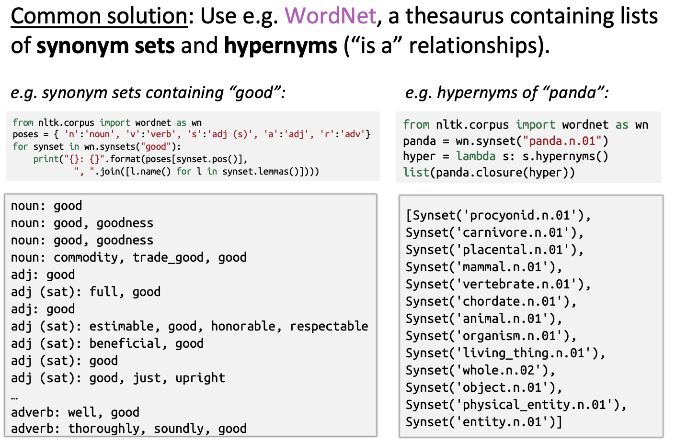

# Lecture 1: Intro & WordVectors

- ### **Languages**
    - languages is a system self-defined by human
    - languages conveys knowledge
    - language is a compression
- ### **2. Represent the meaning of a word**
    - what is 'meaning': the idea generated by people to represent an object/thing, expressed in the work of writing, art, etc.
    - linguistic aspect: meaning is Denotational Semantics
        - a Signifier(idea/thing/..)
- Usable meaning in a computer
    - WordNet: a thesaurus containing list of:
        - synonym sets: 同义词集合
        - hypernyms: 上位关系
    - application
      - ``` python
         from nltk.corpus import wordnet as wn
          ```
        
        
    - disadvantages: subjective, can't compute accurate word similarity, doesn't look at new things.
- Representing word as discrete symbols
    - traditional NLP: regard words as discrete symbols.
        - localist representation: a sparse representation.
        - one-hot representation: present word as one-hot vectors.
    - disadvantages: vectors are orthogonal, no natural notion of similarity for one-hot vectors.
    - how to improve? Learn to encode similarity in vectors.
- Representing word by their context
    - Distributional Semantics: A word’s meaning is given by the words that frequently appear close-by.
        - use the context of a word to build up representations of the word.
        - proved to be good at capturing the meaning.
- Word Vectors
    - represent in a distributional way by building a dense vector which components of numerical numbers (not one-hot but float numbers) chosen by context of the word in order to be similar to.
    - called word embeddings or word representations.
    - use vector distance to represent the similarity of the context.
    - can be visulized by projecting the dimension to 2D or 3D, etc. (PCA or sth)

        

        - a simple multiplication of vectors to represent the 'meaning' behind vectors.
- Word2Vec
    - a framework for **learning** word vectors
    - basic idea
        - use a large corpus
        - use a fixed vector to represent a word (random initialization).
        - text can be divided into center word (c) and a set of context words of the center word (o).
        - use dot product to represent the similarity between two words.
        - compute the probability of $P(c|o)\ or\ P(o|c)$   .
        - adjust word vectors by max the likelihood.
        - loop the process.
    - model variants
        - Skip-grams
            - predict the probability of n_gram words on the both side of the center word.
            - input the center word, output the probability of its n_gram context on both sides.
        - Continuous Bag of Words (CBOW)
            - predict the center word from a bag of contexts.
            - input the contexts and predict the center word.
    - objective
        - $Likelihood=L(\theta)=\prod_{t=1}^T\prod_{-m\leq j\leq m}P(w_{t+j}|w_t;\theta)$
        - $J(\theta)=-\frac1TlogL(\theta)$
            - where, $P(w_{t+j}|w_t;\theta)=\frac{exp(u_o^Tv_c^i)}{\sum_{i=1}exp(u_o^Tv_c^i)}$
                - where u is the center word while v_c is one of the context word
                - it is a Softmax function.
                    - use dot product to compute similarity.
                    - feed into softmax distribution to get the result.
                    - why softmax? it is max because it computes the percentage of each component and it uses exp to make large component larger; it is soft because it still assign some probability on similar x.
    - Optimizing parameters
        - gradient descent
        - the parameters are basically the dimension per vector times the total amount of words in corpus.
        - how to compute the gradient descent
            - $\frac{\partial J(\theta)}{\partial v_c}=\frac{\partial}{\partial v_c}logP(o|c)=\frac{\partial }{\partial v_c}log\frac{exp(u_o^Tv_c)}{\sum_{w=1}^vexp(u_w^Tv_c)}=u_o-\sum_{x=1}^v\frac{exp(u_x^Tv_c)}{\sum_{w=1}^{v}exp(u_w^Tv_c)}u_x=u_o-\sum_{x=1}^vp(x|c)u_x$
                - where u is the context word, e.g. u_{tuning}, u_{into}, etc; and v is the center word, e.g. v_{banking}.
                - the first part is the observed vector of context word. And the second part is what the model thinks the context vector should be based on the center word. And the substration can represent the direction of updation. It is a expectation of multiple potential context word according to the model intuitively.
            - update equation for single parameter

                

            - in gradient descent, the parameters update after finishing computing the J, which is based on the averaging results in the whole corpus.
        - SGD
            - Stochastic Gradient Descent
            - repeatedly sampled windows (gram), and update after each one
            - solve the problem that J is expensive to compute when we compute-and-update after all the windows in the corpus.

- Material 1: Tutorials on Word2Vec model with Skip-Gram
    - a review of word2vec architecture
        - the model
            - basically, word2vec train a nn model but not use that for a task.
            - we actually need the learned vectors in the latent layer.
        - the task
            - it is 'direct-prediction' model. (detail in the Lecture 2, it verses 'count-based')
            - in the Skip-Gram model, the model is given center word, and it needs to predict the probability of the context word by feeding word pairs appeared in a window as the training samples into the nn architecture.
        - model details

            

            - input
                - build a vocabulary of words in the corpus.
                - represent each word as one-hot vector.
            - output
                - the same vector dimension as the input.
                - the output vector contains the probability that every word in the vocabulary appear in the context of the center word.
                - the output vector isn't one-hot, but a probability distribution.
            - the hidden layer
                - lower vector dimension
                - this is what we want
                - Intuitively, if we multiply the one-hot vector to the vector (or weight) matrix in the hidden layer. Only the '1' in the one-hot vector input will select a row in the matrix and exist in the hidden layer, which is the word-embedding of the input.
    - '2'
        - the two variants of Word2Vec are the Skip-Gram model and the CBOW model
        - SG

           

            - First, input the one-hot vector to the network, then look up the W matrix for vector encoding (dimension reduction), then use W' to calculate the context vector, then do a softmax to form the probability distribution. Feed the output to the Loss function, calculate the gradient and do back propagation to learn the parameters.
        - CBOW
            - CBOW is kind of the reverse version of SG model.
        - w2v: learn the weight matrix of each model. (do average)
- Material 2: Word2Vec in applications of recommendation
    - notion in Word2Vec: a word can be inferred from it's context.
        - in recommendation system, the abstracted content that a user browsed can be inferred from ones the users browsed before and after.
        - this allows applying word vectors to learn good vector representations for products&contents&ads.
        - abstract users' actions as context that can be embedded by w2v model.
        - can lift the performance in models like CTR
    - examples
        - music recommendation
            - traditionally, there are two types of recommendation system
                - content-based system: recommend based on the features of the item, for example, we recommend music based on the music genres or sth like that.
                - collaborative filtering -based system: rely on historical usage data to recommend items that similar users have interacted with, for example, we recommend music that B also likes to A if B and A shared many same liked songs.
                    - applications: observe global song preferences across all users and apply matrix factorization.
                - problems: the global co-occurrences across users can give information about how songs are related based on users. However, they don't capture the co-occurrence of songs appears in a time, locally. So they might tell us that users who like song A would also probably like song B, but would they have listened to them in the same playlist or radio? We can therefore see the benefit of looking at not just what songs users play across their lifetimes, but at what context they play those songs in. This leads to W2V model.
            - in the recommendation system of music, we regard user's music queue(list) as a sentence, all users' queues is the corpus, each song in the queue is one token. All we need to do is to use word2vec model to learn the vectors for each 'token' (songs).

                

                - in word2vec, we use a sliding window of corpus as the sample (capturing locally characteristics), and the model learns to predict the probability of nearby contexts after training each sample. (not every word)
                - after getting the vector representations, we can do things like vector arithmetrics, like averaging users' liked songs to represent users.
        - airbnb recommendation
            - apply w2v in capturing vector representations of users' viewed listings on items
            - negative sampling
            - cold start: average geographically near samples as initialization.
        - ads & search queries recommendation
            - learn the representations of queries and ads in the same embedding space.
            - learn from users' activity logs.

- Material 3: Optimizations in Word2Vec
    - [https://proceedings.neurips.cc/paper/2013/file/9aa42b31882ec039965f3c4923ce901b-Paper.pdf](https://proceedings.neurips.cc/paper/2013/file/9aa42b31882ec039965f3c4923ce901b-Paper.pdf)
    - Hierarchical Softmax
        - use a **Huffman** tree to replace softmax in order to avoid computing the softmax results.
            - reduce the time cost from n to log(n).
            - use sigmoid in every node of the tree.
            - gradient ascent, learn the tree parameters
                - LR

    - Negative Sampling
        - make the model update some weights at a time rather than the whole paras.
            - computing softmax of each word need to do sum of every word probabilities.
        - in order to save time, compared to the Hierarchical Softmax method.
        - process
            - for every correct example (take SG model for example, center word w_i and the context(w_i)), we need to find neg negative examples (which is different center word w_j and context(w_i)), thus we can construct a logistic regression of '0' and '1' and use Sigmoid function to classify.
            - how to do the sampling?
                - divide '1' into V(the number of vocabulary) parts, the length of each word in the vocabulary is $len(w_i)=\frac{count(w_i)^{\frac34}}{\sum_{i=1}^ncount(w_i)^{\frac34}}$, where 3/4 is the empirical number.
        - other methods
            - Subsampling
                - delete a word in the training examples with a probability, which is related to the past frequency of the word.
                - 降采样
                - $P(w_i)=1-\sqrt{\frac t{f(w_i)}}$
            - combine a (word, word) to a word to avoid high-frequency words like 'the'.
