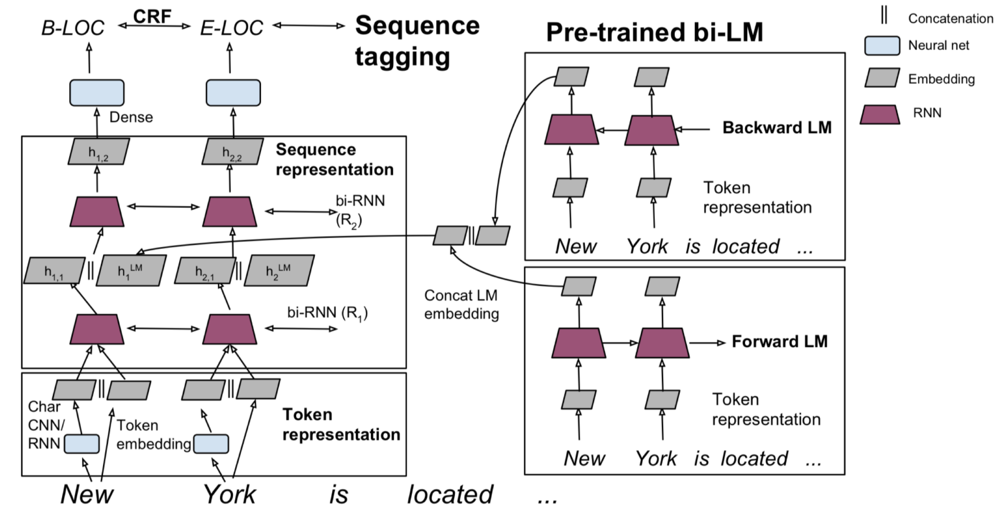

# Lecture 13: Contextual Word Embeddings

### **Reflections on word representations**

- pre-trained word vectors in early days: Word2Vec, GloVe, fastText.
    - btw, tips for unknown words with word vectors
        - use \<UNK> to represent the OOV word
        - but we still need to distinguish different \<UNK> to know the meaning
        - 2 solution:
            - use character-level models
            - for OOV word
                - if \<UNK> exists not in the downstream task but in the pre-trained word embedding, use the pre-trained embedding.
                - else, assign a vector randomly.
                - not sure it will help a lot but it helps
- the models we have learnt have two problems
    - always the same representation for a word type regardless of context (the surroundings in which a word token occurs)
    - we just have one representations for a word, but words may have different aspects, including semantics, syntactic behaviors, etc.
    - recall that LM embeddings are used to compute the probability of future words in a neural LM (RNN,etc.), they are likely to encode both the semantic and syntactic roles of words in context.
- then, people wake up and notice that text sensitive representation captured in the LMs embeddings is useful in tasks (downstream tasks) like the supervised sequence tagging setting.
    - rather than using old word-2-vector way.

 

### **Pre-ELMo and ELMO**

- *Semi-supervised sequence tagging with bidirectional language models. 2017*
    - idea: we want meaning of word in context, but standardly learn task RNN only on small task-labeled data. (e.g. NER)
        - why don't we train a neural language model in the semi-supervised way on tons of unlabeled data?
    - 2017 good in CoNLL2003
    - Tag LM details
        - the traditional Tag LM model is Bi-LSTM-CNN-CRF based. word-embedding concatenated with CNN-based char embeddings are fed into the Bi-LSTM structure and then output to the CRF model to perform tagging.
        - here is the new model

            

            - token representation
                - context-independent word-embeddings (Char-level CNN), concatenated with token embedding from word2vec.
                    - Char-CNN: **output the char-level representation of a word. not pure character.**
                    - ConvNet has been proved to be an effective approach to extract morphological information (like the prefix or suffix of a word) from characters of words and encode it into neural representations.
                - and pass through a Bi-RNN structure as one kind of feature
                    - To learn a context sensitive representation, we employ multiple layers of bidirectional RNNs.
                - then concatenated with another kind of feature: pre-trained word embeddings from neural language model (Bi-LSTM)
                    - **Pre-Trained Using Unlabeled Data**
            - sequence embedding
                - a Bi-RNN structure is used for the features to output the sequence representation
            - softmax classification for NER, sequence tagging.
    - Intuition: the model can be separated into two parts, the sequence tagging model and the LM model. The embedding provided by the LM model can be seen as the insertion from the pre-trained model, it is a augmentation of contextual representation.
    - conclusions:
        - LM trained on domain-specific data does not help
        - bi-RNN structure helps
        - the complex LM design helps (the amount of unlabeled data)
    - Sequence Tagging Task，序列标注任务是中文自然语言处理（NLP）领域在句子层面中的主要任务，在给定的文本序列上预测序列中需要作出标注的标签。常见的子任务有命名实体识别（NER）、Chunk提取以及词性标注（POS）等。
        - NER
            - task: a very important NLP sub-task, find and classify name entities in text.
            - dataset famous: CoNLL 2003, F1 score
- ELMo: EMbeddings from Language Models
    - *Deep contextualized word representations,* 2018
    - good in CoNLL2003 board in 2018 (beyond TagLM)
    - can be used in many NLP tasks, which is the greatest part of the idea.
    - a Bi-LM trained on large corpus. the idea is to represent a good vector of word, we should achieve both semantically (contextual and syntactical) as well as task-specifically. (the idea of pre-training)
    - highlight
        - train a  bidirectional LM
        - goal: aim at performant but not overly large LM (to be used for others):
            - 2 biLSTM layers:
                - lower-level layer: syntax (good for POS tagging, NER)
                - higher layer: semantics (good for sentiment, qa)
            - character CNN to build initial word representation **only**
            - use bigger dim in hidden states of LSTM with smaller dim projections(fnn, to reduce the parameters) to the softmax layer.
            - use a residual connection
        - detail

            

            - stacked Bi-LSTM, with residual connections between layers.
            - for every token, generate $2L+1$ features (where L is the layers of Bi-LSTM).
                - use every layers' output instead of only using the output from the top LSTM layer, which is usually did before.
            - then compress the features into a vector

                

            - for downstream tasks
                - commonly, given a sequence of tokens (t1, . . . , tN), it is standard to form a context-independent token representation xk for each token position using pre-trained word embeddings and optionally character-based representations. Then, the model forms a context-sensitive representation hk, typically using either bidirectional RNNs, CNNs, or feed forward networks.
                - we can first freeze the ELMo weights and concatenate ELMo vector with context-independent x_k. then feed into the task RNNs.
                - further improvements also found in concatenating ELMo vectors with contextual hidden output h_k and feed to classifiers.
        - applications: sequence tagging, etc.

            

 

### **ULMfit and onward**

- *Howard and Ruder (2018) Universal Language Model Fine-tuning for Text Classification.*
- LM transferred for for text classification
    - a transfer learning method that can be applied in NLP tasks.
    - ideas from CV: Language modeling can be seen as the ideal source task and a counterpart of ImageNet for NLP.
- idea: this paper proposes Universal Language Model Fine-tuning (ULMFiT), which pre-trains a language model (LM) on a large general-domain corpus and fine-tunes it on the target task using novel techniques.
- detail: 3 parts.

    

    - general-domain LM pre-training
        - use the state-of-the-art language model AWD-LSTM (a regular LSTM with no attention, short-cut connections, etc.). '1 GPU' model.
        - pre-train the language model on Wikitext-103
        - pre-train is expensive but only need once
    - target task LM fine-tuning
        - fine-tune the LM on data of the target task to learn the task-specific distribution, it is actually faster because of the smaller size of dataset.
            - how to fine-tune? just the LM and a softmax to predict the next word, and in the down stream task, we just need to freeze the softmax layer and apply the classification layer for replacement.
        - tricks: lr in epoch-level and layer-level.
            - discriminative fine-tuning: based on the idea that different layers capture different types of information (higher layer: less general-info), we tune different layers with different learning rates.
            - slanted triangular learning rates: to make the model converge faster to a suitable state, we first linearly increases the learning rate (learn fast) and then linearly decays it (learn slow but details).
    - target task classifier fine-tuning
        - the classifier is designed by augmenting the pre-trained language model with two additional linear blocks (with BN, Dropout layers), a ReLU between the layers and a softmax in the end.
            - the parameters in these task-specific classifier layers are the only ones that are learned from scratch.
        - concat pooling: the first linear layer takes as the input the pooled last hidden layer states. To avoid information loss in just keeping the last hidden's output, we concatenate the avg-pool and max-pool of every hidden output in the last RNN layer.
            - $h_c=[h_T,maxpool(H),meanppol(H)]$, where $H=(h_1,...h_T)$
        - gradual unfreezing: fine-tuning all layers (the whole model: classifier+LM) has the problem of catastrophic forgetting (transfer learning). so we propose the gradual unfreezing, that is, unfreeze the model starting from the last layer (contains least general knowledge), and fine-tune the layer for 1 epoch, then unfreeze the second last layer and fine-tuning again, repeat it until convergence.
- results:
    - text classification

        

    - the performance of transfer learning

        

    - the improvement: SCALE IT

        

        - GPT-2: (2019) TPU-based LMs.
        - all the latter 3 uses transformer architecture

 

### **Transformer architectures**

- the motivation:
    - we want parallelization but RNNs are inherently sequential. we want faster so as to scaling.
    - RNNs still need attention mechanism to deal with long range dependencies (previous like NMT applications in attention, attention is used in Decoder as a support or modification of the output of Decoder's hidden state).
    - since attention give us the access to any state, why don't we just use attention?
- *Attention is all you need, 2017*
    - [http://nlp.seas.harvard.edu/2018/04/03/attention.html](http://nlp.seas.harvard.edu/2018/04/03/attention.html)
- overview: a Non-recurrent sequence-to-sequence encoder-decoder model.
- task: MT with parallel corpus, predict each translated word, CE loss on softmax layer.
- detail

    

    - Input: actual word representations are **byte-pair encodings (recall that in the subword system)** with positional encoding added.
        - positional encoding is used to solve the loss by replacing RNNs.
            - by substituting RNN, we may lose some informations that carries along the chain. but it is good for GPU to do parallelism.
    - Encoder: stacked transformer blocks (6 times vertically, deeply)
        - dot-product attention: $A(q,K,V)=\sum_i\frac{e^{q*k_i}}{\sum_je^{qk_j}}v_i$.
            - problem: as the dim of key gets large, the variance of q*k increase, so the softmax output may be more peak (more closed to one-hot).
            - solution: scaled dot-product attention: $A(q,K,V)=\sum_i\frac{e^{q*k_i/d_k^{\frac12}}}{\sum_je^{qk_j/d_k^{\frac12}}}v_i$
            - word vectors in Encoder can be determined using just attention.
        - self attention: the query, key and value are the same.
        - multi-head attention
            - problem: only one way for words to interact with one-another
            - solution: multi-head, using matrix W to mapping Q K V to h=8 many lower-dimension spaces and apply self attention, then concatenate the output by a linear layer.
            - $MultiHead(Q,K,V)=concat(head_1,head_2,...,head_h)$, where $head_i = Attention(QW_i^Q, KW_i^K,VW_i^V)$
            - to capture different attention output from the sentence, make the embeddings more powerful contextually.
        - complete transformer block

            

            - input are byte-pair encodings
            - each of them has residual connection and LayerNorm (change the input features to have mean 0 and variance 1 per layer). ****
            - **Each block uses the same Q, K, V from the previous layer.**
            - each block has two sublayers.
                - multi-head attention
                - 2-layer feed forward NN (with ReLU)
        - Conclusion: in the Encoder, we can use multi-head attention to see how words look at the sentence in different ways (words properly linked to other words), Then accumulate the information and push that to the next layer, By information features extracted from layers, we can learn a good representations of languages.
    - Decoder
        - masked decoder self-attention
        - Encoder-Decoder attention: query from the previous Decoder layer, and keys&values from Encoder output.
        - 6 repeats on Decoder block

 

### **BERT**

- *Pre-training of Deep Bidirectional Transformers for Language Understanding, 2018*
- motivation
    - problem: LMs only use left or right context, but understanding of language is  bidirectional.
        - unidirectional context: no, directionality is needed.
        - bidirectional context: but words can see themselves in a bidirectional encoder.
        - for example, there are 2 layers of Bi-LSTM, the output (cat[left,right]) of the first layer has the information of the future word in its direction, and it's been pushed to the second layer, which is a crosstalk. Thus the model learns the statistics rather than the real meaning.
    - solution: Bi-directional structure but words can't see themselves: **Mask LM**

        

        - mask out k% (usually 15%) of the input words and then predict the masked words.
        - the training objective is the CE loss on the predictions of the masked words.
- the difference between BERT and GPT: all use transformer but GPT is unidirectional.

    

    - ELMo is bidirectional, but the left-right model and right-left model are trained separately, they just concatenate in the output. So no bidirectional context in training actually.
    - BERT uses bidirectional context to train the masked task.
- complication: next sentence prediction
    - BERT has a second objective, to learn relationships between sentences, predict whether sentence B is actual sentence that proceeds sentence A, or a random sentence. (IsNextSentence or not)
    - **NSP**
- input: sentence pair encoding

    

    - token embedding is the word pieces embedding. (recall from the subword model)
    - segment embedding: whether comes from the first sentence or sth
    - position embeddings is like other transformer architectures.
    - **the 3 representations are summed up as the final token representation. and input into transformer model.**
- BERT architecture and training

    

    - architecture
        - BERT is a transformer Encoder
        - self attention: to capture long dependency
        - single multiplication per layer: efficient on TPU/GPU?
    - train
        - train on WIkipedia+BookCorpus
        - train on 2 model sizes:
            - base version: 12 layer, 12head, 768hidden.
            - large version: 24 layer, 16 head, 1024 hidden.
        - train on 4*4 or 8*8 TPU for 4 days
    - fine-tuning
        - run the BERT for particular task by removing the top layer of original pre-training BERT which is the NSP and MaskLM and replace them with your specific task.
- results

    

    

    - GLUE tasks, CoNLL2003, SQuAD etc.
- same thing in CV like ResNet.