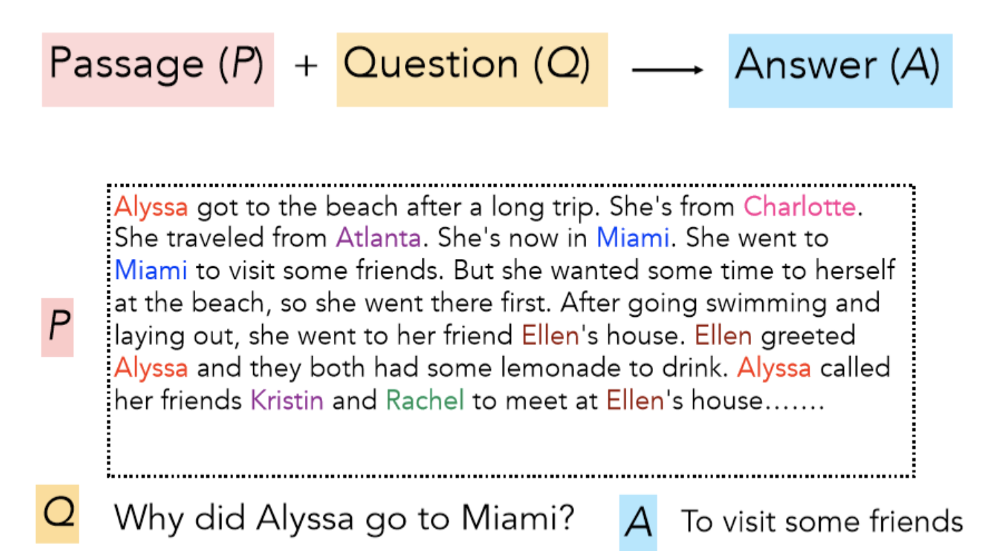

# Lecture 10: Question Answering

### **About Final Project**

- the writeup for project
    - abstract
    - prior related work
    - model
    - data
    - experiments
    - results
    - analysis&conclusion

 

### **QA**

- History
    - movitations
        - it is of limited use to just simply returning relative docs, we want answers.
        - this can be divided into two processes:
            - find relative docs including answers
                - this can be handled by traditional information retrieval (search)
            - find exact answers in these docs
                - the problem is often termed **Reading Comprehension**
                - what we'll focus on
    - history
        - machine comprehension
            - "A machine comprehends a passage of text if, for any question regarding that text that can be answered correctly by a majority of native speakers, that machine can provide a string which those speakers would agree both answers that question and does not contain information irrelevant to that question."
        - MCTestReading Comprehension

            

            - a corpus of 600 such stories
        - 2015 2016, deep learning with production of large datasets which permit supervised neural system to be built.
            - DeepMind CNN/DM dataset
            - SQuAD
            - MS MARCO, TriviaQA, RACE, NewsQA, NarrativeQA.
        - history of open domain question answering
            - a bigger task of QA
            - very firstly, answering questions based on matching dependency parses.
            - later, answer question over an online encyclopedia using IR and shallow linguistic processing
            - now, deep QA systems over traditional ones.
        - architecture of LCC QA system

            

            - firstly parse the question into more semantic form (rule based)
            - classify the question type
            - IR system to find possible docs, sorts and make choices.
            - NER entities and make judgements
            - remarks: works pretty well on **Factoid Question Answering 针对实体的回答**
- the SQuAD dataset
    - v1.1
        - each question has 3 human-answers
        - two evaluation metrics:
            - exact match: 0 if no matching the 3 gold answers, 1 otherwise.
            - F1 score: take system and each gold answer as bag of words, evaluate: $precision = \frac{tp}{tp+fp}$, $recall=\frac{tp}{tp+tn}$, $F1(harmonic\ mean)=2\frac{PR}{P+R}$, $score=avg(F1)$ (macro average). in detail, the precision is the mutual words over the total prediction words, while the recall is the mutual words over the total gold words.
                - tp means an example of class C is rightly classified into class C: good
                - fp means an non-class C example is classified into class C: bad
                - tn means an example of class C is classified into non-class C: bad
                - fn means an non-class C example is classified rightly into a right non-class C: good
                - the accuracy: $\frac{tp+fn}{tp+fp+tn+fn}$
                - the precision means the correct prob in class C
                - the recall means the prob of C being rightly classified
                - the macro and micro precision:
                    - macro: average of precision for every class
                    - micro: no class, calculate in the **instance/example** level: total correct / total correct + total wrong
                    - if the amount of each class is nearly equal, then there is no difference.
                    - if not, choose micro if focusing on the larger class behavior; choose macro if focusing on the smaller.
            - both metrics ignore punctuation and articles like a, an, the, only, etc.
            - leaderboard: solved! (human score is 91%)

            

    - v2.0
        - a defect in 1.0 is that all questions have the answers in the paragraph, system just pick candidates and choose the best one.
        - don't have to judge whether a span answers a question.
            - span: a subset of words from the passage.
        - in 2.0 1/3 in the train set and 1/2 in the dev and test set have no answer, predict NoAnswer gets 1 score.
        - system approach: has a threshold on whether a span answers a question (no need to be the best match) or you can have a second component to confirm an answer like NLP inference to evaluate.
        - leaderboard

            

    - SQuAD limitations: **naturally easy**
        - only span-based answers (matching problems, returning a sub span kind of type..), no yes/no, counting, implicit kind of questions.
        - questions were constructed by looking at the passages
        - barely any multi-fact inference beyond coreference
- the Stanford Attentive Reader model

    

    - simple neural QA system, baseline level
    - details

        

        - use BiLSTM structure to capture the representation of the question
            - put the question in to BiLSTM
            - concatenate two (forward and backward) final hidden state as the representation of the question
        - use attention to find the answer in the passage
            - work out an attention score between each word by LSTM representation with the question
            - train two attentions to find both start token and end token of the answer
            - using bi-linear attention, i.e. $attention=q^TW_s\hat p_i$ where q is the question, p is the word representation from Bi-LSTM.
            - then pass through a softmax to get the prob distribution, find the max.
    - Stanford Attentive Reader ++

        

        - for the question

            

            - use the weighted sum of all hidden state as the representation of the question
                - a learnable weight-sum matrix W
            - train deeper LSTMs to represent
        - for the passage, the representation of every word are concatenated of:
            - word embedding (GloVe 300d)
            - the syntactical characteristics: POS, NER label, one-hot form
            - word frequency
            - exact matching: whether this word is in the question: exact, uncased, lemma
            - the embedding of aligned question: similarity
- BiDAF
    - Bi-Directional  Attention Flow for Machine Comprehension

    

    - the key is the attention flow layer: the attention should flow both ways: from the context to the question and from the question to the context.
    - details
        - Context-to-Question: which query words are similar to context words.
            - $a^i = softmax(w^T_{sim}[c_i;q_j;c_i*q_j])$, calculate the similarity of a context word with every query word.
            - $a^i=\sum_{j=1}^Ma_j^iq_j$, for each context word i, find the most relevant query word.
            - 对一行i，softmax每一列j，一行中最大的softmax值就是最相关的query单词，乘query就是近似算对每个context单词，最相关的query单词。
        - Question-to-Context: the weighted sum of the most important words in the context with respect to the query, slight asymmetry through max.
            - $m_i=max_jS_{ij}$, calculate the most important words in the context with respect to the query. (matrix: context*query, value is the simialrity)
            - $\beta=softmax(m_i)$, the attention within context-based query
            - $c'=\sum_{i=1}^N\beta_ic_i$, for one query, calculate the context representation that aligning to the query.
            - 找：对每行来说最大的列（context和query最匹配，这其实是一种近似），m是一个列向量，代表对整个query最合适的context，再对列softmax，算一列中的概率分布（哪些context中的词最能表示query），最后乘context就是近似算对这个query，最相近的context的表示。
        - for every position in the passage, the output of BiDAF layer is: $b_i=[c_i;a_i;c_i*a_i;c_i*c']$
        - then pass through a model layer: a deeper BiLSTM architecture
        - the output is more complex
            - start token: softmax after a dense layter after the output.
            - end token: the output of BiDAF is concatenated with the output of a BiLSTM after the modeling layer. then pass through a dense layer and softmax.

 

### **Advanced Models**

- recent architectures
    - DCN: Dynamic Co-attention Networks for QA

        

        - Questions have input-independent representations. **Interdependency** needed for a comprehensive QA model
        - bidirectional attention problem for context and questions, co-attention involves a second-level attention computation:
        - two ways of attention
            - we use the C2Q attention distributions αi to take weighted sums of the Q2C attention outputs.
            - 先对每个context word找出对自己最像的query word，作为context的表示，再对query找出对自己最像的context表示。我们认为这个attention是更高阶层的。

            

    - FusionNet: combines many forms of attention.

        
        - MLP form of attention: additive attention
            - $S_{ij}=s^Ttanh(W_1,c_i+W_2q_j)$
        - Bilinear (Product) form
            

    - Multi-Level Inter-attention
        - after multi-level inter-attention, use RNN, self-attention and another RNN to obtain the final representation of context.
        - more complex
- ELMo and BERT preview
    - ELMo: contextual word representations
        - using language model-like objectives
    - BERT: based on transformers

 

### **Material 1: Dynamic Memory Networks for QA**

- General QA: QA task is that, the system extracts information from many sources to meet user's needs. Think from a macro view, if the question can be varied from simple factoid questions (questions that the answer to them is a subset of the passage, considered as the most frequent questions in people's life), to math questions, logical questions, etc. Actually most NLP problems can be considered as QA: we issue a query and the system gives back the answers.
- in order to design a general QA system, there are two main obstacles:
    - different architectures for different NLP tasks. e.g. TreeLSTM for sentiment analysis, Memory Network for QA, etc.
    - multi-task task is very difficult, and transfer learning is still a difficulty.
- We can tackle the first problem with a shared architecture for NLP: Dynamic Memory Network (DMN), an architecture designed for general QA tasks.
- Details: 4 modules

    

    - input module
        - the input of the input module is a sentence with a list of words, or a set of sentences with a list of sentences.
        - let's say the input is a set of sentence (one sentence each time step). for each time step, we first pass the original sentence through a sentence reader, which is a embedding matrix, then pass the embedded sentence to a GRU architecture, the hidden state of GRU is the fact representation.

            

    - question module
        - we also use a GRU to read the question and output the hidden state, which is the question representation.
    - episodic memory module
        - this is the key part, it tells that what subset of the facts set (the episode) should we pay attention in order to answer the question.
        - we use Bi-GRU to achieve, the input of Bi-GRU is the output of the input module, i.e. the facts representation. this Bi-GRU should learn the episodic memory representation.
        - to be specific, $m^i=GRU(e^i,,m^{i-1})$, where m is the episodic memory representation, e is the episodic representation output from an attention system. The initial hidden state is the output from the question module, i.e. the representation of questions.
        - the attention system is as follows: $e^i=h^i_{T_C}=\sum_{T_C}g_t^iGRU(c_t,h_{t-1}^i)+(1-g_t^i)h_{t-1}^i$ where c is the hidden output of the input module and the h_0 is the question representation. This means, the attention mechanism focus on the current facts and the nearby (at the memory level) facts.
            - the attention vector g can be computed in different ways. in the paper it is controlled by a sigmoid gate function. **Intuitively, gates in this module are activated if the sentence is relevant to the question or memory. if irrelevant, gates are closed to 0, the information in the previous state is kept.**
            - In the i th pass, if the summary is not sufficient to answer the question, we can repeat sequence over in- put in the (i + 1) th pass.
    - answer module
        - just a simple GRU decoder, take the output of episodic and question and output a word/result.
- conclusions: the enthusiasm of general architecture is faded these years. More advanced QA can be referred as DCN (Dynamic Co-attention Network).