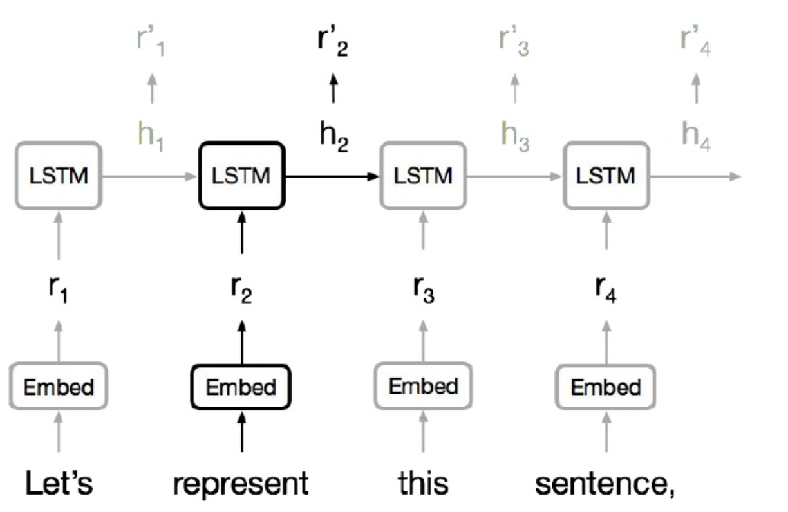

# Lecture 14: Self Attention and Transformers

### **Knowledge Wrapped-up**

- Seq2Seq includes NMT, text summerization, QA, etc.
    - learning representations of variable length data (变长数据) is the basic of Seq2Seq.
    - usually we use RNNs. LSTMs and GRUs are the hot ones.

        

    - it's good to pass the co-reference information throught the sequence to a fixed size vector, however, there are also some disadvantages like:
        - sequence computation is not good for parallelism, slow.
        - to some extent, the problem of long-term dependence has been alleviated, but it has not been eliminated.
            - e.g. for generation task, it may forget the long-ago information, the generated data lacks long-term architecture.
        - RNNs seems wasting
        - no modeling on the hierarchical structure
    - using CNN?

        

        - easy to parallel, fast on GPUs.
        - capture local dependency (receptive fields or sth)
        - but the interaction between long-distance positions is expensive
            - it requires many layers to capture long-distance dependencies
    - attention mechanism: in Seq2Seq structure, attention between encoder and decoder is important.
    - **why not using attention for representing?**
    - self attention

        

- self attention produce a weighted combination of the entire neighborhood, it's like to re-organize the information for better representation.
    - the path between any two position is constant, can capture long-dependency.
    - parallels well
- FFNN: computing new features

 

### **Text Generation**

- convolutional layers have been successful in text generation. Can attention do the better?
- before transformer, there are many works on self attention
    - classification with self-attention
    - self-attention with RNNs
    - recurrent attention
- transformer

    

    - encoder self attention

        

        - the structure of the encoder in transformer: (let's say to re-represent 'represent'):  2 matrix multiplication.
            - first input a sentence with embedding and permutation, transform the target word as the query and other words as the key.
            - then, for the query, dot product(can be other attention computation methods (but dot product is designed for simplicity and speed)) with the other keys and pass through a softmax to get the attention weight.
            - next matmul with the value matrix (value==key) to get the attention output, a vector that better represent the query vector.
                - plus itself, mix the information with itself.
            - pass through a FFNN
        - very fast in GPU, simultaniously for all positions.
    - decoder self attention

        

        - it almost the same with encoder, but the values and keys comes from the last layer output of encoder (the encoder-decoder attention).
    - attention is cheap

        

        - it is super good when the dimension (word_vocab) is larger than the length.
        - the dim is the vector dimension.
        - think about textcnn, the computation is when the kernel(kernel_width\*word_vector_dim) multiplies with the data matrix(word_num\*word_vector_dim).
        - think about RNN (LSTM), the computation is when the input(length\*word_vector_dim) multiplies with the weight matrix(hidden_vector_dim\*word_vector_dim).
    - optimization: multi-head mechanism

        

        

        - attention is kind of like a feature detector, we can't extract different information if we only have one attention layer for every word. we need different feature detector to find different relations between words by projecting in different space (intuitively to focus on different features).
            - ideas come form the kernel in convolutional layers.
        - multi-head can be done parallel.
        - done by transforming the K, Q and V through a linear layer to different vector space before applying scaled product attention.
    - optimization: add position information in the input layer, and use residual structure to pass through layers.

        

    - training process:
        - ADAM optimizer with a learning rate warmup (warmup + exponential decay)
        - Dropout during training at every layer just before adding residual
        - Layer-norm
        - Attention dropout (for some experiments)
        - Checkpoint-averaging
        - Label smoothing
        - Auto-regressive decoding with beam search and length biasing

 

### **Self-similarity, Image and Music Generation**

- image generation
    - self similarity
    - probabilistic image generation
        - model the joint distribution of pixels and turn it into a sequence modeling problem
    - CNNs and RNNs are SOTA
        - CNNs incorporating gating matches RNNs in quality
        - CNNs are much faster due to parallelism
    - keys
        - long-range dependencies matter for images
            - modeling long-range dependencies with CNN requires either num_layers or large kernel_size.
        - measure the importance in pixel/part level
    - seems self attention is useful! (**computation mechanism**)
    - generate self-similar images, previous works
        - texture synthesis with self similarity
        - non-local means algorithm
        - autoregressive image generation:
    - the image transformer

        

        - two dimensional position representations
        - but recall that the attention is cheap if length << dim, the dimension is not way more than the length in image tasks
            - combining locality with self-attention: restrict attention windows to be local neighborhoods. (rasterization)

                

                - good for images because of the spartial locality
                - In every self-attention layer, each position in a query block attends to all positions in the memory block.
                    - query block, to save computation cost, so that we can use the same memory matrix within every query block
                - For all queries from a given query block, the model attends to the same memory matrix, comprised of all positions from the memory block.
                - The self-attention is then computed for all query blocks in parallel.
            - local 1d attention
            - local 2d attention
        - not proceed GANs
- music generation: another way to use self-similarity
    - prior work
        - RNNs

            

            - each time step is an input, various features.
            - disadvantages: bad parallelism, lack of long-term and hierarchical dependency (think about repetition).
    - some inspirations
        - attention:
            - a weighted average of the history (good at capturing motifs), we have direct access to it (fast and cheap).
            - but has positional issues
        - convolutional:
            - fixed-size filters, good at capturing informations within relative distances.
        - multi-head self-attention
        - relative attention (Shaw et al. 2018): convolution(on positions)+attention.
    - music transformer:
        - [https://link.zhihu.com/?target=https%3A//arxiv.org/abs/1809.04281](https://link.zhihu.com/?target=https%3A//arxiv.org/abs/1809.04281)
        - idea: transformer can be good at music generation, where there is self-similarities.
        - self-attention in transformer
            - problem: 原始的Transformer依赖绝对定时信号，因此很难跟踪基于相对距离、事件顺序和周期性的规律。
        - relative positional self-attention
            - in all, the relative positional self-attention uses a window(k=) within the samples to capture the positional information based on distance embedding, and gather that embedding in the attention equation (multiplication with the query embedding).

            

            - relative position representations to allow attention to be informed by how far two positions are apart in a sequence.
            - *Self-Attention with Relative Position Reoresentations, 2018 NAACL.*
            - motivation: RNN能够让模型隐式地编码序列的顺序信息，所以，不同位置上针对于相同输入的输出是不同的，但transformer在这方面有所欠缺，自注意力层对不同位置出现的相同词给出的是相同的输出表示。归根究底是缺少位置顺序信息。在input前的position mebdding不够强大。因此，作者提出在transformer中加入一组可训练的embedding，让输出的representation有position信息，即RPR。
            - 有两组RPR需要学习，第一组是输入词的RPR表示（RPR matrix），第二组是词与词之间的查找表（RPR look-up table）。
            - 针对一句话的输入。本文构造了一个可以训练词相对距离的embedding表示RPR(H,L,D_h)。其中H表示head的embedding，L可理解为L个index，若我们规定一个词只与它相邻窗口k=4的词有关，那么这个k一共有9中，即自己+上面四个+下面四个，所以针对一个句子，不关注具体是哪个词和哪个词，只关注位置（因为我们学习的的毕竟是position embedding），我们需要学习9中相对位置的信息。举个例子，比如一个句子有5个词，对每个词有L=9个嵌入要学习（某一词的上面k个下面k个，k=4，k为窗口大小），D_h表示该index下相对距离的distance embedding。

                

            - RPR的查找表（look-up table）：RPR代表现对位置的embedding，那么针对于一个句子的输入，我们需要另外学习一个查找表，查找表的作用应为对每个词对：(i_q,i_k)，value为RPR值，即相对距离对应的。举个例子，若k为3，查找表如下：行列表示词i和词j，值表示词i和词j的相对位置，即第0行第0列为3代表是自己与自己（设k=3，3为自己）这时候就得出RPR matrix中的index为3时的distance embedding，同理value为6应该查找第6个RPR matrix中的向量因为相对位置为3，即i与i+3的位置差。
                - 设置k是为了locality。在loop-up表中，第一行在第四个位置后都是6就代表，对于第一个词，只看window内的，window外的都当作index为6的RPR distance embedding值来看。
                - 设计这样基于相对位置的RPR，就是relative position。
                - RPR表不仅只有下图的两维，第三维是两维表对应value所对应RPR的值。（比如value为3那么在RPR中就是index为3时的distance embedding vecrtor）
                - RPR look-up table: (seq_length, seq_length, dis_embedding)

                

            - RPR加入attention formula
                - raw scaled dot-product self-attention formula: $attention=\frac{(x_qW_q)(x_k,W_k)^T}{(d_k)^{\frac12}}=\frac{(Q)^T(K)}{(d_k)^{\frac12}}$
                - 加入RPR时，应该将position embedding和key embedding加在一起，即: $attention=\frac{(x_qW_q)((x_k,W_k)+a_{ij}^K)^T}{(d_k)^{\frac12}}=\frac{(x_k,W_k)(x_qW_q)^T+(x_qW_q)(a_{ij}^K)^T}{(d_k)^{\frac12}}$，因此我们要对分子的后半部分进行实现。
                    - 分子的第一部分是传统attention的输入，即(batch_size, h,  seq_length, embedding_dim)，代表query和各key的dot product结果，是attention的一部分。为了能让矩阵乘法搞笑运算，分子两部分必须相同。
                    - 分子的第二部分是query和各key在位置信息上的结果。
                    - 拆解第二部分：
                        - query是(x_k\*W_k)，即(batch, h, seq_length, embedding_dim)，后两维即query中所有词以及其embedding。
                        - 首先，我们（学习）查找RPR look-up table，给输入序列生成张量A(seq_length, seq_length, dis_embedding)，三维分别为：query输入中的每个词，每个key（实际就是自己，即和query一样的序列），表中的value（RPR的index，即第i各词和第j个词的位置差）对应的distance embedding。
                        - 其次，对A进行转置(seq_lgnth, dis_embedding, seq_length)，对输入序列query进行转置+变形(seq_length, batch\*h, embedding_dim)。相乘得(seq_length, batch\*h, seq_length) （三维矩阵乘法，保留第一维，乘后面）。
                        - 这个结果的意义是query中每个词的vector和RPR distance embedding的点积(embedding_dim\*dis_embedding)。这个乘积有seq_length\*seq_length个，意思是对每个word，都有它和包括自己在内的所有其他word的向量和位置嵌入的乘积。
                        - 最后转置+变形乘(batch, h, seq_length, seq_length)配合分子的第一部分进行相加。这一部分就是论文中的S。
        - efficient implementation of relative position-based attention:

            this paper improves the implementation of relative attention by reducing its intermediate memory requirement from O(L2D) to O(LD).

            

            - Here the improvement is space complexity, the theoratical time complexity is the same but in practice the improved version is faster.
            - rather than multiply the query with the R table. this paper proposed that query multiply directily with the embedding RPR is ok as well, which is space-cheaper.
            - achieve this by the skewing algorithm
                - query和RPR矩阵相乘得到的结果(i_q,r)是对这个query，与query所在坐标i_q相距r的向量的乘积结果。而我们需要一个确切i_k的坐标，即通过(i_q,r)找到(i_q,i_k)，然后根据这个坐标找到value即q word对k word的dis_embedding。这样就不用再学习一个RPR look-up table了。
                - 所以我们需要找到k与r的关系

                    

                    - 由上表，对于一个r的index，意思是i和i+(r-(L-1))的距离，此时我们的L=5，i就是这时的行数i_q，所以r-(L-1)+i_q为i_k。
                    - 所以我们需要对结果进行skew，歪斜一下，调整顺序。通过numpy实现。如上上图，r-L+1，pad就是+1，shape成(L+1,L)保留后l个就是-L，最后i_q==i_k，达到我们目的。
        - continuation to given intial motif

            

            - repetitions
    - other applications: relative attention and graphs
        - message passing NN
        - graph library, etc.
    - other applications: transfer learning
    - future: self-supervision on images and videos, understanding transfer, multitask learning, long-range attention.