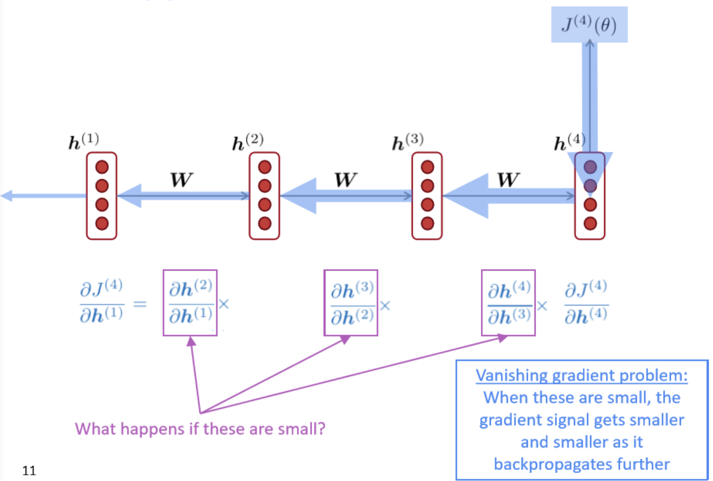

# Lecture 7: Vanishing Gradients and Fancy RNNs

### **Problems with RNN and Solutions**

- Vanishing gradient problem
    - vanishing gradient problem happens at remote (very previous) hidden states in RNN.
    - sketch proof

        

        - as the picture shows, the gradient of the loss function over remote hidden state is decided by a chain of multiplications. if elements in the chain become small, the gradient will be too small to back propagate further.
        - to be more specifically
            - the hidden state: $h^t=\sigma(W_hh^{t-1}+W_xX^{t}+b)$
            - so the element in the chain of multiplication is: $\frac{\partial h^t}{\partial h^{t-1}}=diag(\sigma '(W_hh^{t-1}+W_xX^t+b))W_h$
            - so the multiplication chain when considering step i over step j is: $\frac{\partial J^i(\theta)}{\partial h^j}=\frac{\partial J^i}{\partial h_i}\prod_{j<t\leq i}\frac{h^t}{h^{t-1}}=\frac{\partial J^i}{\partial h^i}W_h^{i-j}diag(\sigma '(W_hh^{t-1}+W_xX^t+b))$
        - we can see from the above formula that the $W_h^{i-j}$ is where the vanishing gradient comes from. paper proofs that, if the largest eigenvalue of W is less equal than 1, then the gradient will shrink exponentially; on the other hand, if greater than 1, the gradient will explode (become exponentially greater). it will be 'dangerous' for bp if the layer goes deeper.
        - so, the gradient from far way is smaller than gradient from closed by. eventually the gradient for far away will get lost and, the model only update parameters closed by and far away parameters will rarely learn.
            - gradient can be regarded as a measure of the influence of the past towards the future.
        - RNN models are more going to learn sequential recency rather than syntactic recency. so gradient vanishing problem is a bigger one in RNNs.
    - fix vanishing gradient problem
        - the key is to preserve information over the past.
            - maybe we can create a separated memory to store the information
        - LSTM: long short time memory
            - characteristics
                - both hidden state h and a cell state. however, the cell state is more like the hidden state in RNN and the hidden state in LSTM is just an output of the cell state at this time step.
                - the selection of which information is forget/written/read is controlled by Gates.
                - the gate value is dynamic (learnable parameters in LSTM), and is a value range from [0,1].
            - details

                

                

                - gates: how they are computed
                    - forget gate: controls what is kept and forget from previous cell state.
                        - $f^t=\sigma(W_fh^{t-1}+U_fX^t+b_f)$
                    - input gate: controls what is written to the cell state.
                        - $i^t=\sigma (W_ih^{t+1}+U_iX^t+b_i)$
                    - output gate: controls what parts of the cell state output to the hidden state.
                        - $o^t=\sigma (W_oh^{t+1}+U_oX^t+b_o)$
                - cell states & hidden states
                    - $\hat c^t=tanh(W_ch^{t+1}+U_cX^t+b_c)$, new cell content at this time step, tanh function to map a non-linear value rather than using sigmoid.
                    - $c^t=f^t*c^{t-1}+i^t*\hat c^t$, forget some of the previous and add current cell content.
                    - $h^t=o^t*tanh(c^t)$, read some of the output content as the hidden state. it can be viewed as the partial output of the cell memory.
                - conclusion:
                    - **the final current cell state** depends on the **previous cell stat**e controlled by a forget gate, and **the new cell content** (depends on the previous hidden state and the current input) controlled by an input gate.
                    - **the final current hidden state** depends on the current cell state controlled by an output gate.
                    - gates depend on hidden state and current input with learnable parameters
                    - the activate function: sigmoid for performing (0,1) mapping and tanh for adding non-linearity.
            - how LSTM avoid the vanishing gradient problem
                - compared to Vanilla RNN, which use hidden state to represent the history and only use a weight matrix W to make updates, LSTM uses cell state, combines the history and the new content for updating.
                - the key of LSTM on overcoming the vanishing problem is as follows
                    - first, it uses gate function to keep memory. think about when calculating the gradient in LSTM (like the chain of multiplication in RNN), since the $h^t=o^t*tanh(c^t)$, the partial derivative of h_i over h_j can be simplified as the partial derivative of c_i over c_j, so the gradient can be represented as: $\prod_{i<t\leq i}\frac{\partial c_t}{\partial c_{t-1}}=f\_gate=\sigma(W_fh^{t-1}+U_fX^t+b_f)$. So, if the value in forget gate is 1 then the memory information is kept (parameters in the forget gate are learnable).
                    - second, we can notice that there are more additions in LSTM, which means there are more routes when we calculate the gradient based on the multi-variable chain rule. On the one hand, more routes means the change of being small gradient decreases. On the other hand, some routes such as $c^t=f^t*c^{t-1}+i^t*\hat c^t$, the gradient flow is stable so as to keep from vanishing.
        - GRU: gated recurrent units

            

            

            - a solution to simplify LSTM. no cell state, just use the hidden state.
            - details
                - gates: how they are computed
                    - update gate: controls which part of the hidden state is updated or preserved.
                        - $u^t=\sigma(W_uh^{t-1}+U_xx^t+b_u)$
                    - reset gate: controls which part of previous hidden state are used to (how important is) the new hidden state content.
                        - $r^t=\sigma(W_rh^{t-1}+U_rx^t+b_r)$
                - hidden states
                    - $\hat h^t=tanh(W_h(r_t*h_{t-1}+U_hx^t+b_n))$: new hidden state content generated at this time step, combines the new observed input and the past hidden state.
                    - $h^t=(1-u^t)*h^{t-1}+u^t*\hat h^t$: the final current hidden state balances which parts of the past to remember and which part of the new to stay, combines the new hidden state and the previous hidden state value.
                - conclusion:
                    - the mechanism: at each time step, **a new hidden state content** will come up, and the **final current hidden state** that will be passed to the next time step depends on the new content and the **previous hidden state**.
                    - gates depend on the previous hidden state and the current input
                    - the new hidden state content depends on the previous hidden state controlled **by an reset gate** and the current input.
                    - the current hidden state depends on the previous hidden state and the new content, controlled **by an update gate.**
                    - a non-linearity (tanh activation) before passing the new content to calculate the current hidden state.
            - GRU solve the problem of vanishing gradients by retaining long-term information as well.
            - comparison between GRU and LSTM
                - GRU is simpler, quicker, fewer parameters, and efficient.
                - LSTM is a default choice for most tasks.
    - gradient vanishing exists in all deep models
        - not just RNN
        - solutions: add more direct connections (allowing the gradient to flow).
            - ResNet (skip-connection, only)

                

            - DenseNet (dense-connection)

                

                - all previous layers are connected to the current layer.
            - HighwayNet, etc.
                - control the balance of connection and the output of the final layer
- Exploding gradient problem
    - What is exploding gradient problem?
        - think about gradient descent, the common used updating formula for learnable parameters is: $\theta ^{new}=\theta^{old} - \alpha \bigtriangledown _{\theta}J(\theta)$, if the gradient is bigger, the updating step is bigger, which may lead to a bad updating.
        - the cliff problem: if the gradient is steep, the update step may be too large to miss the optimal value.
    - solutions to the problem

        

        - gradient clipping: if the norm (||gradient||) is greater than a threshold, then scale (take a smaller step but in the same direction) the gradient down before gradient descent.

 

### **Fancy RNNS**

- Bidirectional RNNs

    

    - both left-right and right-left
    - forward RNN and backward RNN, then concatenate (or mean, etc) as the output.
    - not applicable in LM model since LM model only provide left context available
    - powerful if having an entire sequence, e.g. BERT.
- Multi-layer RNNs

    

    - also called stacked RNN
    - make RNN more deep, deep means more complex.
    - hidden states become the input of the next layer of RNN
    - skip connection or dense connection need to train deeper RNN as well (e.g. 8 layers).
    - e.g. transformers

 

### **Materials 1: Batches in RNN**

- the batch in RNN
    - when use batches to training RNN, the batch can be view as (number of examples per batch,length of sentence), the difference length problem can be solve by padding.
    - layer normalization
    - since the batch of RNN is (number of examples per batch,length of sentence) and the context information is within every sentence (which may be not in the same length), so the normalization should be done within every sentence (every sentence is a whole) in order to make it easier for computation in RNN.
    - in CNN the normalization is performed within every position in the input example since every position in the input may contain the relatively same type of information and they are input into the same neuron.
    - but i still have a question, how is RNN handle indefinite length problems in input/output？the input and output of RNN can be different size, and the inputs can be different and the outputs can be different, as well. is that true?
        - the input and output can be different in size
        - the inputs can be different in size as well by padding

 

### **Materials 2: RNN applications**

- Machine Translation
    - RNN translation model

        

        - the naive structural RNN MT model is that we use the last hidden state of the Encoder as the input hidden state of Decoder, the Decoder is also a simple RNN, and the output hidden state of Decoder based on the hidden state (add a softmax for probability distribution of the translated sentence) is the translation result.
        - there are lots of extensions
            - train different RNN for Encoder and Decoder
            - make Decoder more complex: the hidden output of Decoder depends on the combination of: the previous hidden state, the last hidden layer of corresponding position in Encoder, and the previous predicted output (hidden state) in Decoder.

                
            - go deep: stacked RNN
            - go bi-directional
            - go reversed: given a word sequence A B C in German whose transla- tion is X Y in English, instead of training the RNN using A B C → X Y, train it using C B A → X Y.

 

### **Materials 3: Understanding LSTM Networks**

- [http://colah.github.io/posts/2015-08-Understanding-LSTMs/](http://colah.github.io/posts/2015-08-Understanding-LSTMs/)
- the problem of long-term dependencies
    - RNNs are good at retaining the information, in theory.
    - but in practice, RNNs are only ideal when the information gap is small. When the gap grows, RNNs behave badly.
    - this is because the vanishing gradient problem
- LSTMs
    - special kind of RNN, capable of learning long-term dependencies. It improves the repeating structure, use four interacting ways as a layer instead of a chain of one repeating modules.
    - the key to LSTMs is the cell state, which is easy for information to just flow along unchanged.
    - another highlight of LSTM is the gate function. Gates are a way to optionally let information through.
    - details
        - forget gate: which information from previous steps is going to forget.
        - input gate: which information from the current input is going to learn.
        - output gate: which information of the current cell state is going to output.
        - cell state: the infromation stored, the infromation to remember from the past + the information learnt from the current input.
        - hidden state: the output from the cell state.
    - hidden output and the final output
        - hidden output at each time step
        - final output from one layer is the combined information of the whole input (sentence or sth). Often used as the output of the Encoder.
- LSTM variants
    - peephole LSTM: adds peepholes to all/some gates

        

    - forget/add together: Instead of separately deciding what to forget and what we should add new information to, we make those decisions together.

        

    - GRU
    - Highway/Residual structures
- stacked LSTMs

    

    - 在深度循环神经网络中，隐藏状态的信息不断传递至当前层的下一时间步和当前时间步的下一层
- LSTM's disadvantages
    - although LSTM theoratically solve the long-dependency problem by solving the vanishing gradient. In practice there is still information loss in the last LSTM hidden output of the whole input(a sentence). In all, RNNs are not inductive i.e. they may have a good memory of sequences but they are not good at generating correctly.
    - computationally expensive
    - And RNNs are expensive in time complexity, etc.
- Attention: the next step.
    - the idea is to let every step of an RNN pick information to look at from some larger collection of information.
    - example of attention

    

    - attention comes from the area of NMT. in Neural Machine Translation, a commonly-used structure is called Seq2Seq. There is a Encoder and a Decoder in Seq2Seq where the Decoder uses the final hidden state of Encoder (recognized as the summary of the input sentence) as the initial hidden state of the whole translation. (Alternatively we can use the final hidden output as the input in every step of Decoder).
    - but instead of that, in every step of the Decoder we can actually do better by looking at every step's hidden output of the Encoder, weighted average them as the attention output.
    - in his example, attention mechanism is a support for the LSTM.
    - later, attention replaces LSTMs and RNNs, Transformer take places.
    - attention variants: soft attention, hard attention, local attention, self attention.

